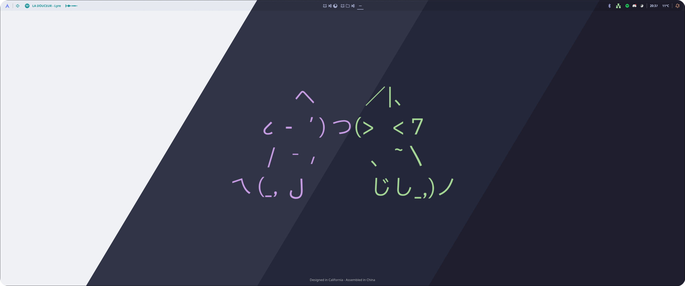
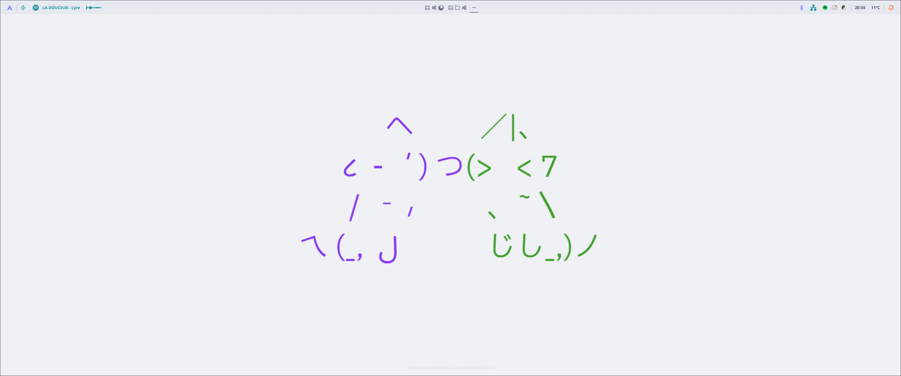
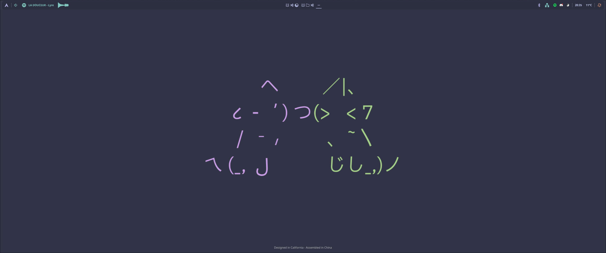
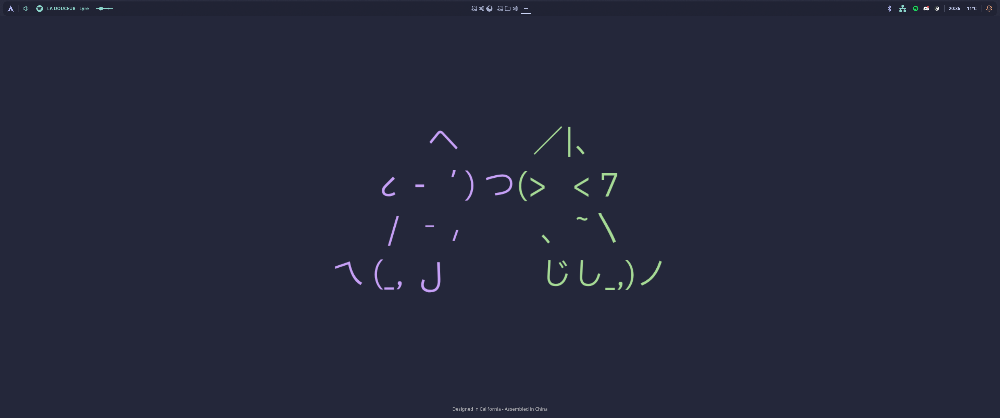
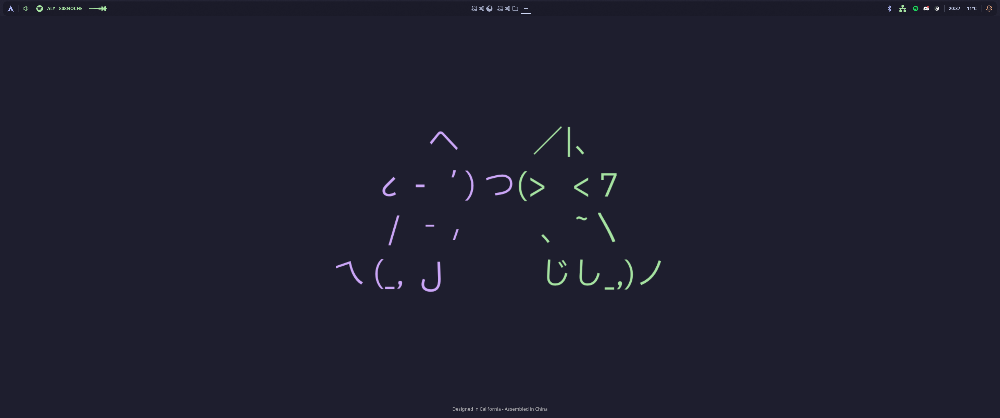

<h3 align="center">
	 
	
	Catppuccin for <a href="https://github.com/wayle-rs/wayle">Wayle</a>
	
</h3>

	
	
	

	

## Previews

🌻 Latte

🪴 Frappé

🌺 Macchiato

🌿 Mocha

## Usage

1. Download the [flavor](./themes) of your choice.
2. Copy the whole *[[styling.palette]]* section and paste it into *~/.config/wayle/config.toml*
3. Configure *~/.config/wayle/config.toml* so that your modules use your colors

<!-- The FAQ section is optional. Remove if needed.-->
## 🙋 FAQ

- Q: **_"How do I configure Wayle ?"_**\
  A: Take a look to the [wayle repository](https://github.com/wayle-rs/wayle) or to *~/.config/wayle/config.toml.example*. You will see all the available options, try them, and enjoy !
- Q: **_"How can I choose between other colors than the ones already implemented ?"_**\
  A: Check releases, or just select your favourite colors from the [catppuccin palette](https://catppuccin.com/palette/) and manually apply them into *~/.config/wayle/config/toml*

## 💝 Thanks to

- [GaetanQu](https://github.com/GaetanQu)

&nbsp;

	

	Copyright &copy; 2021-present <a href="https://github.com/catppuccin" target="_blank">Catppuccin Org</a>

	

